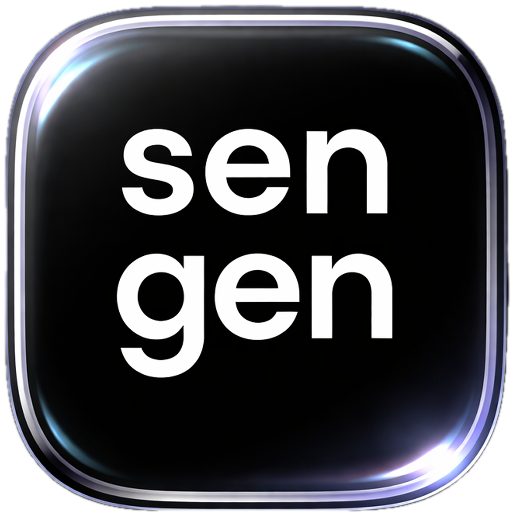

<!-- PROJECT LOGO -->
<br />
<div align="center">
  <a href="https://github.com/dafraer/sentence-gen-grpc-client">
    
  </a>

<h3 align="center">Sengen</h3>

  <p align="center">
    Sengen is a desktop app that automatically generates Anki flashcards with example sentences, translations, and definitions — powered by AI. Just enter a word, pick your languages, and send it straight to your Anki deck.
    <br />
  </p>
</div>


<!-- TABLE OF CONTENTS -->
<details>
  <summary>Table of Contents</summary>
  <ol>
    <li><a href="#about-the-project">About The Project</a></li>
    <li>
      <a href="#tutorial">Tutorial</a>
      <ul>
        <li><a href="#installation">Installation</a></li>
        <li><a href="#setting-up-anki-and-ankiconnect">Setting Up Anki and AnkiConnect</a></li>
      </ul>
    </li>
    <li><a href="#features">Features</a></li>
    <li><a href="#contact">Contact</a></li>
  </ol>
</details>


<!-- ABOUT THE PROJECT -->
## About The Project

Sengen connects to a backend AI service via gRPC to generate high-quality Anki cards on demand. Enter a word, choose the word language and translation language, and Sengen will generate an example sentence with translation, a standalone translation, or a monolingual definition — then add it directly to your chosen Anki deck via AnkiConnect. Optionally attach text-to-speech audio to any card.

The UI is available in English, Russian, Turkish, and Spanish.


<!-- TUTORIAL -->
## Tutorial 

### Installation

Download the latest build for your platform:

| Platform | Download                                                                                                           |
|----------|--------------------------------------------------------------------------------------------------------------------|
| macOS    | [Sengen.dmg](https://github.com/dafraer/sentence-gen-grpc-client/raw/refs/heads/main/builds/darwin/Sengen.dmg)     |
| Windows  | [Sengen.exe](https://github.com/dafraer/sentence-gen-grpc-client/raw/refs/heads/main/builds/windows/Sengen.exe)    |
| Linux    | [Sengen.tar.xz](https://github.com/dafraer/sentence-gen-grpc-client/raw/refs/heads/main/builds/linux/Sengen.tar.xz) |

**macOS:** After downloading, open `Sengen.dmg` and drag `Sengen.app` to your Applications folder. Eject the dmg afterward. On first launch you may need to right-click -> Open to bypass Gatekeeper.

**Windows:** Run `Sengen.exe` directly — no installation required.

**Linux:** Extract the archive and run the binary:
```sh
tar -xzf Sengen.tar.xz
./sengen
```

---

### Setting Up Anki and AnkiConnect

Sengen communicates with Anki through the [AnkiConnect](https://ankiweb.net/shared/info/2055492159) add-on. Follow these steps to get it running:

#### 1. Install Anki

Download and install Anki from [apps.ankiweb.net](https://apps.ankiweb.net).

#### 2. Install AnkiConnect

1. Open Anki.
2. Go to **Tools -> Add-ons -> Get Add-ons…**
3. Enter the code **`2055492159`** and click **OK**.
4. Restart Anki when prompted.

#### 3. Verify AnkiConnect is running

AnkiConnect runs a local HTTP server on port **8765** whenever Anki is open. You can verify it's working by visiting [http://localhost:8765](http://localhost:8765) in your browser - you should see a JSON response.

> **Note:** Anki must be open and running in the background whenever you use Sengen.


<!-- FEATURES -->
## Features

#### 1. Open Anki and Sengen

Make sure Anki is running before launching Sengen. Sengen fetches your deck list from Anki on startup.

#### 2. Choose a page from the sidebar

Sengen has three card generation modes accessible from the left sidebar:

- **Generate Sentence** — generates an example sentence for a word, with its translation.
- **Translate** — generates a direct translation card for a word.
- **Generate Definition** — generates a monolingual definition card for a word.

#### 3. Fill in the form

Each page has a short form:

| Field | Description |
|-------|-------------|
| Word | The word you want to study |
| Word Language | The language the word is in |
| Translation Language | The language to translate into (Sentence and Translate pages) |
| Translation / Definition Hint | Optional hint to guide the AI output |
| Deck | Select the Anki deck to add the card to |
| Include Audio | Toggle to attach TTS audio to the card |
| Voice | Choose Male or Female TTS voice (enabled when Include Audio is checked) |

#### 4. Submit

Click the submit button. Sengen will call the AI backend, generate the card content, and add it to your selected Anki deck. A system notification will confirm success or report an error.

#### 5. Review in Anki

Switch to Anki and start a review session for your deck — your new card will be there, ready to study.

<!-- CONTACT -->
## Contact

Kamil Nuriev — [telegram](https://t.me/dafraer) — kdnuriev@gmail.com
